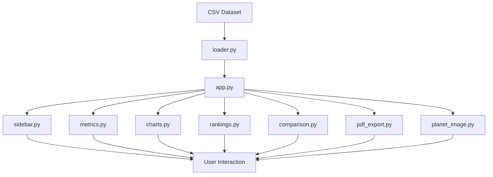
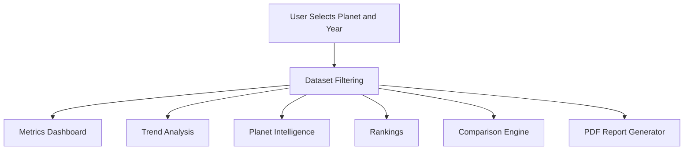

<div align="center">

# 🌌 Galactic Civilization Dashboard

### Monitor the rise, prosperity, and occasional collapse of fictional interstellar civilizations

[](https://python.org)
[](https://streamlit.io)
[](https://pandas.pydata.org)
[](https://plotly.com)
[](https://www.reportlab.com)

<br>

### 🔗 Links

**[Live Demo](https://galactic-civilization-dashboard-bw3w5rjzfhanw896jfmvwm.streamlit.app/)** • **[GitHub Repository](https://github.com/JatinChoudhary-07/galactic-civilization-dashboard)**

</div>

---

## 📖 Overview

The Galactic Civilization Dashboard is an interactive analytics platform built using Streamlit, Pandas, Plotly, and ReportLab.

The application simulates a fictional galaxy where civilizations evolve over time with unique population sizes, economies, military strengths, technology levels, and happiness scores.

Users can monitor planetary development, compare civilizations, analyze long term trends, and generate downloadable intelligence reports.

What started as a dataset filled with completely random numbers eventually became a surprisingly fun way to explore data visualization, dashboard design, modular Python development, and report generation.

---

# 📸 Preview

### Dashboard Overview


*Monitor civilization growth through key metrics, trend analysis, planetary intelligence, and downloadable reports.*

---

### Light Mode Experience


*Switch between dark and light themes while exploring the galaxy.*

---

### Civilization Comparison & Rankings


*Compare civilizations side by side using ranking systems, performance tables, and radar chart visualizations.*

---

# ✨ Features

| Category | Features |
|-----------|-----------|
| Civilization Monitoring | Planet Search, Planet Selection, Year Selection, Status Tracking |
| Analytics | Population, Economy, Military, Technology, Happiness |
| Visualizations | Interactive Plotly Charts, Historical Trends |
| Comparison Tools | Multi Planet Analysis, Radar Charts, Rankings |
| Reporting | PDF Intelligence Reports |
| User Experience | Dark Mode, Light Mode, Responsive Layout |

---

# 📊 Metrics Tracked

| Metric | Description |
|----------|-------------|
| Population | Measures civilization growth |
| Economy | Tracks economic development |
| Military | Represents defense capabilities |
| Technology | Indicates scientific advancement |
| Happiness | Reflects citizen satisfaction |

---

# 🏗️ System Architecture



---

# 🔄 Application Workflow



---

# 🛠️ Technology Stack

| Layer | Technology |
|---------|------------|
| Frontend | Streamlit |
| Programming Language | Python |
| Data Processing | Pandas |
| Visualization | Plotly |
| Report Generation | ReportLab |
| Styling | Custom CSS |

---

# 📂 Project Structure

```text
galactic-civilization-dashboard/

├── app.py
│
├── assets/
│   └── planets/
│
├── components/
│   ├── charts.py
│   ├── comparison.py
│   ├── metrics.py
│   ├── pdf_export.py
│   ├── planet_image.py
│   ├── rankings.py
│   ├── sidebar.py
│   └── status.py
│
├── data/
│   └── galactic_civilization_data.csv
│
├── styles/
│   ├── main.css
│   └── light.css
│
├── utils/
│   ├── loader.py
│   ├── lore.py
│   └── theme.py
│
├── requirements.txt
└── README.md
```

---

# 🚀 Installation

### Clone Repository

```bash
git clone https://github.com/JatinChoudhary-07/galactic-civilization-dashboard.git

cd galactic-civilization-dashboard
```

### Install Dependencies

```bash
pip install -r requirements.txt
```

### Launch Application

```bash
streamlit run app.py
```

---

# 🔮 Future Enhancements

- Civilization forecasting
- Resource management systems
- Diplomacy and alliance tracking
- Dynamic galactic events
- Advanced intelligence reports
- Additional planetary metrics

---

# 👨‍💻 Author

| Field | Information |
|---------|------------|
| Name | Jatin Choudhary |
| Program | B.Tech CSE (Blockchain Technology) |
| Batch | 2025–2029 |

---

> *The civilizations are fictional. The data is generated. The lessons learned are real.*
